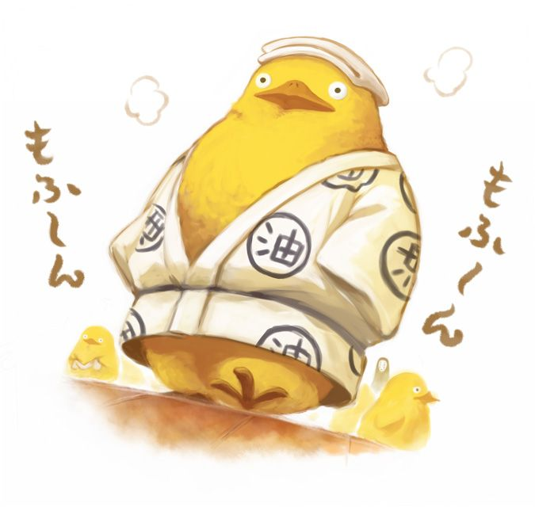
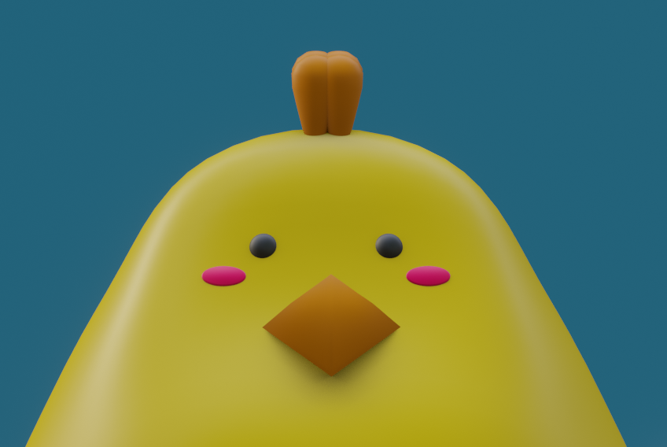
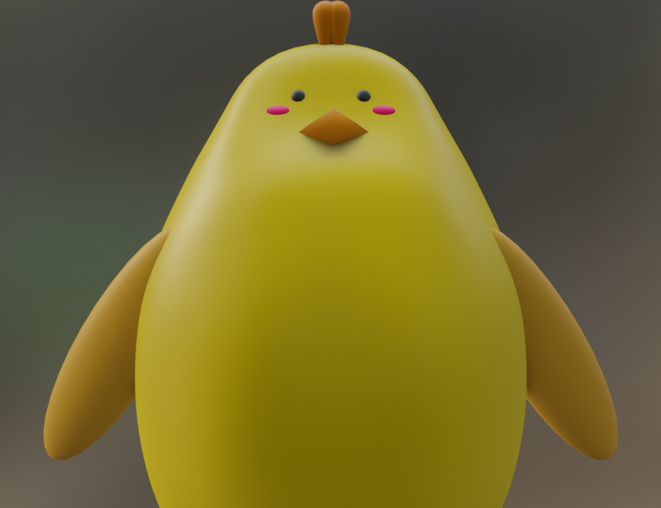
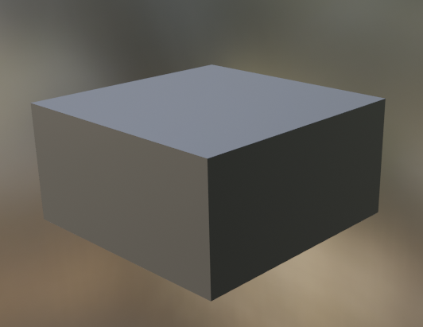
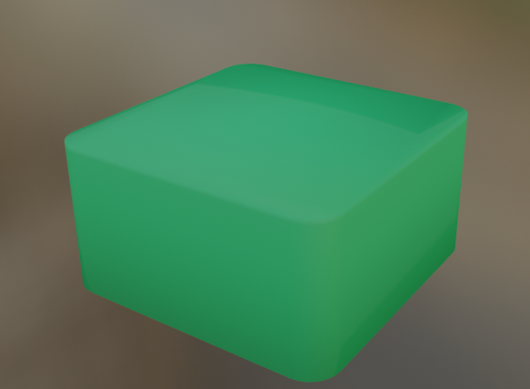
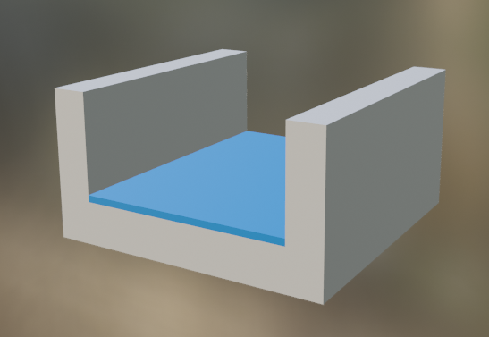
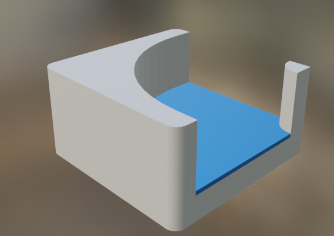
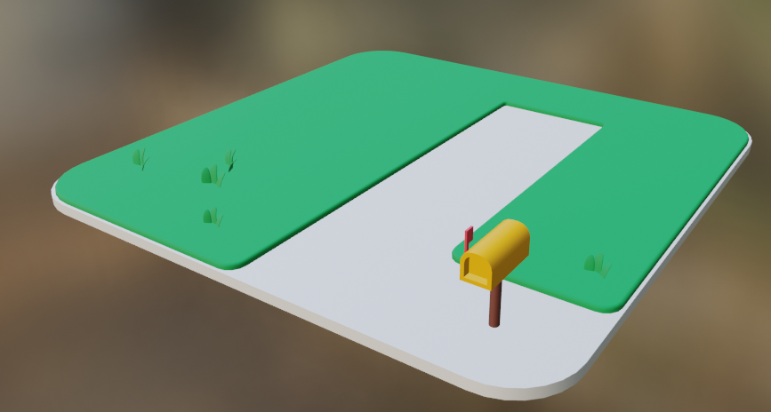

**The University of Melbourne**
# COMP30019 – Graphics and Interaction

## Teamwork plan/summary

<!-- [[StartTeamworkPlan]] PLEASE LEAVE THIS LINE UNTOUCHED -->

<!-- Fill this section by Milestone 1 (see specification for details) -->

We will be using Confluence to keep track of our weekly progress and organising all of our intellectual work. We will be having weekly meeting to ensure smooth discussions and to report to Project Manager, Mukul. Weekly, Fortnightly and Montly goals will be set to ensure each Deliverable is submitted.
|Role | Who |
| ----------- | ----------- |
| Physics | Sebastian |
| Gameplay | Mukul, Sebastian, Jason |
| General Vertex and Pixel Shaders | Daniel |
| Particle| Daniel |
| Animation | Daniel and Sebastian|
| Objs and Assets | Mukul |
| Music, SFX and Sound Assets | Jason |
| Procedural generation (scenery + maps) | Mukul |
| Camera Orientation and Controlling | Jason |
| Querying and Playtesting and Surveying | Jason and Mukul |
| Level Design | Mukul and everyone |
| Storytelling and Objectives | Mukul |


<!-- [[EndTeamworkPlan]] PLEASE LEAVE THIS LINE UNTOUCHED -->

## Final report

### Table of contents
* [Game Summary](#game-summary)
* [Technologies](#technologies)
* [Using Images](#using-images)
* [Code Snipets](#code-snippets)
* [How To Play The Game](#how-to-play-the-game)
* [UI Design](#ui-design)
* [Gameplay Design](#gameplay-design)
  + [Player Movement](#player-movement)
  + [Camera Perspective and Control](#camera-perspective-and-control)
  + [Verticality](#verticality)
  + [Rivers and Respawn Mechanic](#rivers-and-respawn-mechanics)
  + [Medal System](#medal-system)
* [Custom assets](#custom-assets)
  + [Chiki: Model](#chiki-model)
  + [Chiki: Animation](#chiki-animation)
  + [Package](#package)
  + [Base Tiles](#base-tiles)
  + [Buildings](#buildings)
* [Querying Technique](#querying-technique)
  + [Questionnaire Results](#questionnaire-results)
* [Improvements from Evaluation Information]()

### Game Summary
Chiki’s Delivery Service is a Casual Simulation 3D Platformer featuring ragdoll physics delivered by Tea Stain Studios. In Chiki’s Delivery Service, the player takes on the role of Chiki, an aspiring young chick who has just started her employment in the esteemed Chicken Delivery Service company. 

Being a casual game, Chiki’s Delivery Service focuses on simplicity both in gameplay and visual design in order to deliver an enjoyable experience to players with varying experiences and interests in gaming.

As Chiki, the player will tackle various levels involving bypassing several obstacles to successfully deliver packages to the designated area. Each level will feature procedurally generated terrain. The goal remains consistent across all levels: deliver the package successfully.

Upon delivering the package successfully, the player clears the level and unlocks the next one. Additionally, players will also be awarded Bronze/Silver/Gold medals based on their completion time on that level. Each level features different thresholds of completion time for the medals, adjusted accordingly with the expectations of the time taken to complete the level.


### Technologies
Project is created with:
* Unity 2022.1.9f1 
* Blender  version 2.91
* Adobe Illustrator 2022


### How To Play The Game
As briefly outlined, Chiki’s Delivery Service is a game where players traverse a level to pick up packages and then deliver them to the goal point as fast as possible. To do so, players can utilise the terrain and gameplay mechanics. Using Chiki’s strong legs and wings, players can jump up objects that have more height, allowing them to reach further places or perhaps even reach places faster through the glide mechanic. Players are able to jump up to mailboxes, houses and trees. In order to reach some areas in the map, players might be required to chain jumps from objects that are tall to objects that are taller such as from the ground to mailboxes then to houses.

Standard WASD movement and spacebar jump is used to control Chiki. Additionally, players can also hold spacebar when Chiki is in the air to glide through the air. Be careful of falling in the water though as Chiki is not a good swimmer. Falling in the water means Chiki has to dry itself and start again!

There are 2 modes of gameplay available for the player in Chiki’s Delivery Service. These are called “Delivery” and “Exploration” modes respectively and can be accessed through the “Level Select” and “Exploration” buttons in the Main Menu.

Delivery mode is the standard mode where the players are able to enter levels in which they need to find the package and then deliver it to a destination as fast as they can. Clearing a level awards the player (and Chiki) a bronze medal for the level. In order to achieve silver medals and gold medals, players will need to utilise their proficiency in gameplay mechanics and knowledge of the level in order to deliver the package and complete the level within a shorter duration of time. After all, customers always want their packages to be delivered quickly.

Exploration mode is an alternative mode which is offered to players which are concerned with just generating a random level in which they can just navigate around and explore in, without concern of package deliveries. Of course, exploration mode also allows players to experiment and train their gameplay mechanics for package deliveries.

### UI Design
Focusing on the theme of simplicity, Chiki’s Delivery Service provides players with simplistic and modern-looking UIs to interact with. All of the UI utilises white text on black translucent backgrounds. A simple color scheme was chosen in order to prevent imposing eye fatigue on the players.

Furthermore, a minimap and goal distance indicator has also been provided to the user as part of the gameplay experience. The goal distance indicator first indicates the distance of Chiki to the package, and then when Chiki picks up the package, the indicator then indicates the distance of Chiki to the final delivery area. If the player was to pick up the package then die while leaving the package in an area for whatever reason, it is then their responsibility to remember where they had placed the package and the goal distance indicator will not switch back to telling the player Chiki’s distance to the package. This is a conscious decision to deliberately impose some form of punishment to the player for mistakes.

The minimap and goal distance indicator help the player navigate around the levels more easily in order to complete them, providing them with a smoother and more enjoyable gameplay experience instead of deliberately imposing unnecessary frustration on players in searching for the goals around the level themselves, especially on initial playthroughs.

### Gameplay Design 
As highlighted in an earlier section, the theme of Chiki’s Delivery Service is simplicity. Undoubtedly, the theme dictated many of the gameplay design decisions taken. 

#### Player Movement
In order to achieve simplicity, Chiki’s Delivery Service was implemented with a simple control scheme for the player. For player (Chiki’s) movement, standard WASD keys were used as this control scheme is a simple yet effective standard in the games industry, being used across many games. We deemed that the players would appreciate the intuitive control scheme that they may already be used to from other games. Even if this were their first-ever game, the WASD movement would be extremely easy to learn as well. In keeping with the goal of intuitive movement control, SPACE was chosen as the jump key, with gliding achieved by holding space. This ensures gliding feels natural to use in conjunction with jumping to perform air manoeuvres.

A custom player control script was created, loosely adapted from a first person movement tutorial [17], to enable the ‘movement feel’ to be finely tuned to align with other core aspects of the game. To achieve this, we first modelled the player with the Rigidbody component, which provides an abstraction for assigning a game object with mass, moments of inertia, drag, and angular drag, along with methods for applying force and torque. The WASD movement system was implemented by calculating a movement direction vector and adding force to Chiki in that direction.

```c#
private void MovePlayer()
{
    playerDir = orientation.forward * forwardsInput + orientation.right * sidewaysInput;
    
    //...

    rigidBody.AddForce(playerDir.normalized * accel, ForceMode.Acceleration);
}
```

In the case of walking on a slope, the GroundCheck method would determine the angle of the slope by performing basic trigonometry using the normal vector to the slope. For a sufficiently steep slope, this allowed the direction vector to be projected onto the plane defined by the normal vector to the slope [18], ensuring force was applied parallel to the slope as opposed to partially into the slope.

```c#
private void MovePlayer
{
    //...

    // project direction onto plane of a slope, if on sufficiently steep slope
    if (slopeAngle > slopeThresholdAngle && slopeAngle < maxAngle) {
        playerDir = Vector3.ProjectOnPlane(playerDir, slopeNormal);
    }

    //...
}
```

A key design choice was to store Chiki’s movement state as an enumeration which would then determine the effect of the controls as well as inform the animations played. For example, the simple case of being unable to jump while in the air, or the more subtle changes to acceleration and drag between aerial and ground states. To achieve smooth movement and physics, the Fixed Update abstraction within Unity was employed, allowing forces to be applied at a fixed rate of 50 times per second. Where the smooth application of force wasn’t required, physics was calculated within the standard update method. This allowed actions such as jumping or changing Chiki’s state (and consequently the animation being played) to appear with lower latency when the framerate was in excess of 50 frames per second.

#### Picking Up and Throwing the Package
A core game mechanic is the ability to pick up the package and release it into the goal area. In addition to the Chiki, the package was also modelled with the rigidbody component, to allow for intuitive physics interactions with the package, such as pushing it or rotating it via the movement keys. When the package is detected to be in the range of the player, pressing the E key connects a spring joint between the package and Chiki, with necessary offsets to hold the package in Chiki’s arms. If the package deviates in position above a certain threshold, such as when Chiki rapidly rotates or attempts to clip the package through an obstacle, the package is automatically detached. This encourages smooth and precise movement and camera control while also ensuring physics interactions with the package remain reliable. Furthermore, the spring joint allows for interactions with the held package and other colliders to feel intuitive and predictable, due to the linear restoring and inclusion of damping [19], aiding the player in building skill with the game mechanic.

#### Camera Perspective and Control
We chose a Fixed Angle Third Person (FATP) camera perspective as the default camera perspective. This was due to several reasons. Firstly, in order to keep the control scheme simple for the player, we chose Fixed Angle Third Person but took inspiration from the camera controls of a First Person (FP) camera perspective as we deemed that the control scheme of an FP camera was the simplest. Instead of choosing an FP camera which would immerse the player themselves into the game environments, we wanted the player to play the protagonist of the game, Chiki and assimilate themselves with Chiki instead. Lastly, we wanted to provide players with a wider perspective than that of an FP camera for them to be able to look at more of the game environments and aesthetics.

In order to implement these ideas, we then took a standard but yet slightly innovative design approach. First, whenever a player is in a level and the level is not paused, the player’s cursor is locked to the game, this allows for smooth detection of movements along the x and y axis according to the player’s mouse. Mouse movements along the x-axis which are horizontal movements are then used to rotate Chiki and the camera horizontally corresponding to the same direction of the player’s horizontal mouse movement. However, for vertical rotation, we did the same but the rotation only applies to the camera and not Chiki. This prevents awkward placements of Chiki’s model such as the model being slanted and floating off the ground. While this may not necessarily be a problem in the default camera view, later on in the development process, we introduced alternative camera perspectives based on the player’s feedback and suggestions which would potentially display such awkward placements. Evidently, this decision allowed us and will continue to allow us to proactively prevent such issues.

#### Verticality
Verticality refers to the gameplay mechanic of being able to reach points of different heights in the game which adds another layer of depth in the gameplay experience. The initial idea of Tea Stain Studios regarding verticality was that it should be implemented and allowed but made hard such that players who were more proficient in their controls would be rewarded by being able to do so. However, that design decision proved to be a mistake and we have improved upon it based on player feedback and suggestions. More details are discussed in the section about Improvements conducted to the game based on information gathered from evaluations.

### Rivers and Respawn Mechanics
The rivers are direct obstacles which force the player to use the jump and glide mechanics to overcome. Combined with verticality, the rivers are another gameplay aspect which allow us to more creatively design levels to provide players with a better gameplay experience. 

We made the conscious decision to design the rivers as “kill zones” that serve as time wasters. After all, the ultimate goal of the player is to deliver the package as fast as possible. By carelessly dropping in a river, Chiki is respawned back to the start and the player has to navigate all the way through the level again. 


#### Medal System
The intention of the Medal System is to increase the replayability of the game as well as reward the player with a sense of accomplishment. In order to decide the time thresholds for the Silver and Gold medals, we extensively playtest the level in order to determine reasonable timeframes that we can complete the levels in. We then added some additional time to those thresholds to allow for players who are more inexperienced to still be able to achieve the medals. Additionally, while some of the time thresholds may allow the player to be able to achieve the medals on their first playthrough of the level, the general idea is that the players are more likely to achieve medals from subsequent playthroughs, when they are familiar with the level environment and terrain, as well as the locations where they may need to navigate to. 

### Graphics Pipeline
Regarding the graphics pipeline, we had decided to apply custom HLSL shaders on environmental variables that, although may not reduce the burden on the CPU, does enhance the game’s visuals in a way that does not directly clash with our envisioned aethstetics.

### Water/River Shader
As one of the core mechanics of the game is Chiki’s ability to jump and glide, rivers were used as obstacles for all levels. Because of this, we decided early on that a custom shader should be applied to the water tiles - specifically, a material with a wave shader was applied onto a plane in the river tile prefab. This shader can be found in \Assets\Prefabs\Map\Shaders under the name “WaveShader.shader”.

#### River Vertex Shader
As it is a river, we wanted the vertices of the mesh to move in a wave-pattern, not unlike what was practiced in Workshop 7. In the vertex shader, the vertices along the x-axis of the mesh is displaced along the y-axis through a wave function. The value of the amplitude and the period of the wave could thus be changed as parameters of the material, with higher amplitudes and shorter periods to be used for stronger water currents if we were to extend the project further.

In addition to this, since the shader uses UV mapping to project a premade texture onto the surface of the plane, we had found that the UV values of the mesh can be manipulated in the Vertex Shader to achieve a “scrolling” effect of the image texture. Therefore, in the vertex shader, the x-component of the UV values were changed with respect to time (initially added by the value of time multiplied by 0.1, but later changed to subtraction to switch direction of scroll). Combined with the vertex displacement by wave allowed for a relatively good impersonation of moving water.

#### River Pixel Shader
_Phong Illumination_

We wanted the river to have some form of interaction with lighting in order to show off more depth as well as to better blend the shading of the material with the rest of the environment assets. We therefore decided to use Phong Illumination, which is the sum of ambient, diffused, and specular lighting, in order to achieve a “realistic” illumination in the context of a cartoon aesthetic. In addition, we decided to do this through Phong Shading, or in other words, apply the technique in the pixel shader as we thought that would achieve a more smoother shade across the vertices of the plane in addition to being able to interact with other illumination techniques.

### Custom assets
#### Chiki: Model
To provide our game with a unique feel we decided to create our main character ourselves. Our game name took inspiration from Studio Ghibli’s famous movie Kiki’s delivery service. So to make Chiki for our Chiki’s delivery service, we decided to explore Miyazaki’s universe even further. 
From our extensive research, we fell in love with Ōtori-Sama from another famous production Spirited Away [3]. Ōtori-Sama resembles a big duck. We knew from then we wanted our Chiki to be a big chicken with similar aesthetics to Ōtori-Sama. 

<p align="center">
  
</p>
<p align = "center">
Fig. - Ōtori-Sama [3]
</p>

We used Blender to make Chiki. Red freckles and a crown were added to give our model a chicken-like appearance. The model has small feet, a small head and a large body to emphasise its cute aesthetic. 
We wanted players to feel comfortable and love Chiki not only in-game but also outside. Our plan is to make everyone fall in love with Chiki and make it into a brand.

<p align="center">
  
  
</p>

<p align = "center">
Fig. - Chiki Design. Made in Blender.
</p>


#### Chiki: Animation
Using blender, we then created a custom skeleton rig for Chiki, and through the help of tutorials [32][33], created animations for her. The animations we made for her included a state for being idle, running, starting to jump, middle of a jump, the end of a jump, and gliding. In addition, all animations excluding gliding had a “package” variant where both of Chiki’s hands are stretched outwards for the cases where Chiki is holding a package.

The animated model was then exported as a .fbx file and imported into our unity project to be used for gameplay.
| gif of chiki running and idle


#### Package
Package asset was taken from sketchfab[24]. We decided to keep the mesh the same but modify the texture to match our game. The texture was edited and enhanced using Adobe Illustrator. 

#### Base Tiles
Tiles are the fundamental object of our maps. Tiles are used to define the base of our world, and more objects are built on top of these. The look of these tiles had to be carefully created to set the basic ambience and theme of the world. We kept the styling of these tiles simple, so when they come together there isn't much of a mesh merge conflict. The dimensions were kept to 8x8x4 (W x L x D). Currently ‘base tiles’ consist of a road, grass, a building, and two river tiles: straight and corner.

<p align="center">
  
  
  
  
  
</p>

<p align = "center">
Fig. - Base Tiles (Made in Blender).
</p>

#### Buildings
Currently, Chiki’s Delivery Service only has 1 type of Building, i.e. house. These buildings are procedurally generated with a random height. The max building height is set to 4. The height of the building is weighted towards a smaller number, so a house with 1 floor is more likely than one with 4 floors. We created the buildings in a way that makes them easy to procedurally generate, i.e. parts are made to fit together nicely. The inspiration for the building style came from ‘polygonrunaway’ [29]

### Querying Technique
The querying technique used was a Questionnaire. The questionnaire consists of a combination of open-ended and scalar questions which were designed through the inspirations of using past experience in answering game questionnaires and searching online for questions that could be used in game questionnaires. The questionnaire had 25 participants in total, in which the population was random University of Melbourne students that were all aged 18-24. The gender distribution was 52% female and 48% male with no non-binary participants.

Participants were asked to complete the tutorial level of the game, and immediately take the questionnaire after. The questionnaire prompted the participants to rate several aspects of the game such as the Player and Camera Control Scheme, Menu and UI, Level Design, Aesthetics. Participants were also prompted to provide suggestions on improvements they would like to see with regard to these aspects. During the questionnaire, participants were encouraged to first write down their initial impressions and then revisit the game if they wish to. 

The questions asked on the survey were:

**What is your gender?** (Male, Female, Binary, Prefer not to say)

**Which of the age ranges below do you fall under?** (18-24, 25-34, 35-44, 45-54, 55-64, 64 and above)

**How often do you play games?** (1 for Never, 5 for Extremely Often)

**What genre of games are you interested in? Please select all that apply.** (MMORPG, FPS, TPS, RTS, MOBA, Party Games, Puzzle Games, Simulation and Sports, Platformers, Sandbox, Horror/Surival, Storytelling Adventure, Rhythm Games, None). Clarifications of the genre and examples were provided where needed.

**Was it easy to navigate through the menus? (Main Menu, Level Select Menu, Options Menu)** (1 for Not at all, 5 for Extremely easy)

**Are there any additional features you would want implemented in the menu?** (Open-ended question)

**How long did it take for you to complete the tutorial level?** (Open-ended question)

**How much did the tutorial help in teaching you to understand the mechanics of the game?** (1 for Not at all, 5 for Extremely helpful)

**How was your experience in using the control scheme for player movement?** (1 for Extremely Difficult, 5 for Extremely Easy)

**How was your experience in using the control scheme for camera movement?** (1 for Extremely Difficult, 5 for Extremely Easy)

**Are there any changes you would want made to the control scheme of either the player or camera movement?** (Open-ended question)

**What do you think about the level environments?**  (Map, Objects, Music, Audio etc.) (Open-ended question)

**Did you experience any issues in the level?** (Open-ended question)

**Are there any things you would like to see be added to levels?** (Open-ended question)

**Were you satisfied with the game?** (1 for Not satisfied at all, 5 for Extremely satisfied)

#### Questionnaire Results
**Gender**: 52% Female, 48% Male, 0% Non-Binary and Prefer not to say

**Age**: All playtesters were within the 18-24 year age range.

**Frequency of playing games (out of 5)**: 40% of the playtesters said they play games a lot (i.e. score of 4-5), 20% said rarely (score of 1) and rest said once in a while (2-3). This showed us that we have a large variety of audience from people who have never played games to experienced gamers. 

**Genre**: Of all game genres, the majority of playtesters (52%) were interested in playing Party and Puzzle games. The other genres had varying amounts of interest, with the average interest of all genres to be around 25%. 

**Menu Navigation**: 60% gave 5/5 for ease of navigation, 35% gave 4/5 and 4% gave 3/5.

**Additional features to implement in Menus**: “Back button”, “Visual instructions”, “Best time (goal/something to aim for)”, “Change key options - e.g. customised keys; “Just a start game option as opposed to a level select”.

**Tutorial completion time**: The time varied drastically from 15 seconds to over 5 minutes. 50% of the playtesters finished the tutorial in under 1 minute. Further 30% taking somewhere between 1-2 minutes, another 15% finishing within 2-3 minutes and 5% taking over 5 minutes to finish. 

**Mechanics Understanding**: 92% of the playtesters strongly agreed (4-5/5) that the tutorial was very helpful in teaching them to understand the mechanics of the game. 8% said it was somewhat helpful(3/5). 

**Player Movement Control**: 80% rated the control scheme for player movement 4-5/5. 16% rated 3/5 and 4% of the playtesters gave a rating of 2/5. Furthermore, These ratings directly correspond to how much difficulty the player had their overall impression of the game. 

**Camera Movement Control**: Similarly to Player Movement Control, 80% gave a rating of 4-5/5. However this time 12% gave a rating of 2/5 , and 8% gave a rating of 3/5. This suggests that participants found camera movement controls much harder than player movement controls. 

**Changes Suggestion to Movement Controls**:  Most of the comments suggested that no changes were required. Some said “camera movement was very fast” and asked to “decrease sensitivity”. This issue was easily resolved when sensitivity was changed from the menu and also on the mouse. A participant suggested “ability to see chicken from the front” would be nice or “a button to dance”.

**Level environment (Map, Objects, Music, Audio etc)**: Most comments received were positive and commented that  “they are cute”, “aesthetics work well in harmony” and “very pretty”. Some also commented that music was “fun”. Some described the environment as “simple yet effective at creating the environment and world”, and “very fitting”. We also received some critical feedback, suggesting that the world may be “a little flat” and “ didn't immediately know where I needed to go.” Some also mentioned that it was hard “to see where the character was” on the minimap. 

**Issues experienced**: Most common issues were due to how the participants did not immediately know what they needed to do after picking a package or nothing happened when they jumped into the river. One participant mentioned that these might be due to “multiple popups, unclear info”. 

**New addition to levels**: Common requests included more levels and complexity to the environment and gameplay. Some suggested “more trees”, a “complicated landscape”, “higher ground”, “quest markers”, “obstacles”, “elevation”, “zombies”, “moving traps/enemies”, “eggs” , “trampolines as jump pads”.

**Overall Satisfaction**: 92% of the participants were moderately to very satisfied (4-5/5) with the game and 8% were somewhat satisfied. 

As outlined, Chiki’s Delivery Service is a casual 3D platformer simulation game. Furthermore, it is likely that the playtesters will draw on their knowledge and experiences of games similar to Chiki’s Delivery Service to provide us feedback. Hence, we deemed that the playtesters showing a high interest in game genres which are more casual-friendly and related to Chiki’s Delivery Service such as Party games and Simulation and Sports' games (40% interest) would provide us specialised feedback to act upon. Due to diversity of interest in games, we are also able to obtain general feedback from a diverse range of people. Leveraging both general and specialised feedback allows us to improve the game for people who have no experiences in playing such games as well as drawing upon the knowledge and experiences of the people who have played such games and the comparisons they make to other similar games.

### Improvements from Evaluation Information
Certain aspects that had a lower rating than others had more focus put into them by the team for improvement based on reviewing suggestions provided by the participants. Not all the suggestions were deemed to be helpful but there were a handful of helpful suggestions that the team agreed on implementing that would improve the gameplay experience. Furthermore, the team was also limited in regard to the resources available for the improvement of the game. For example, one suggestion from both the Questionnaire and Cooperative evaluation was to introduce a hard mode where enemies would chase you down while delivering the package. This represents a huge shift in the core gameplay and we deemed that we did not have enough time and resources in order to implement changes such as this. 

Thus, based on the resources available, the project team roughly established a priority hierarchy of changes to be conducted based on the time and knowledge required to implement the change as well as how much the change would improve the game. Given the amount of feedback received, we were unable to implement many of the suggestions, but we were still able to implement a significant amount of suggestions that we deem were very helpful in improving the game.

Certain playtesters indicated in the Questionnaire that the camera angle was too zoomed into Chiki, and hence they could not see the environment around Chiki. To counteract this, an additional camera angle which is more zoomed out has been implemented. Players can use the “c” key whenever they are in the level to switch between the default camera angle and the zoomed-out camera angle. The cooldown for switching the camera angle is set to 1s to prevent the switching from occurring too fast and potentially causing dizziness and photosensitive epilepsy.

A large number of participants in the Cooperative evaluation verbally and visually showed interest in seeing the front of Chiki. To make our playtesters more connected to Chiki at all times, we introduced the concept of Face live cam. The feed of the camera appears on the left-hand side of the screen under minimap at all times. Thus, giving players a way to always see how Chiki looks from a different angle. We purposely did not lock this camera to the front of Chiki but allowed a free rotation so players can see Chiki moving and inspect all sides of Chiki if they wish to. 

Some players have also expressed their desire for more verticality in Level Design in the Questionnaire and Cooperative evaluation (“height map”). While verticality was implemented in the build that the participants were playtesting on, such as jumping on mailboxes and houses, it was extremely hard and inconsistent to do so. Most of the participants did not even notice that it was possible. As such, we increased the jump force parameter of Chiki which allows Chiki to jump higher and get up to houses and trees. Hence, we are also able to more easily and creatively design levels incorporating this feature of the gameplay. This change should hopefully provide players with a more enjoyable and exciting gameplay experience. 

The build given to the playtesters to playtest also did not have the respawn mechanic implemented when Chiki lands in the water. The majority of participants expressed dissatisfaction with this in the Questionnaire. Similarly in Cooperative evaluation, this need was communicated as “add[ing] teleporters”. Hence, the team made it a priority to quickly implement the mechanic and thus it is now functional.

Most playtesters indicated that they were satisfied with the level of environment and the aesthetics chosen in the Questionnaire and Cooperative evaluation. However, one participant pointed out that the sky looked strange and could use improvement. The build given to the participants was indeed just using the default Unity “sky” and thus the team also implemented a sky asset from the Unity Asset Store [28] to make the level environment look more polished and detailed, in order to provide a better gameplay experience.

Some participants in the Cooperative evaluation displayed their dissatisfaction with the size of the minimap. The build given did not have a way to easily identify the player on the minimap, which made it difficult to navigate. Participants found themselves squinting to identify their position. Our maps scale drastically as players progress to higher levels. Thus, we understood the importance of this and added an icon on the minimap which follows Chiki and scaled the minimap itself by 2x, to make it easier to identify where a participant is on the map. 

