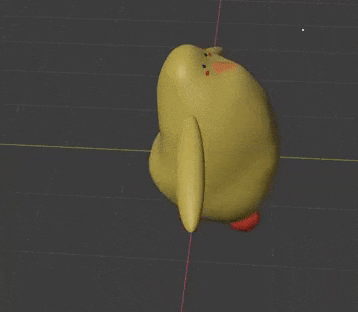

**The University of Melbourne**
# COMP30019 – Graphics and Interaction

## Teamwork plan/summary

<!-- [[StartTeamworkPlan]] PLEASE LEAVE THIS LINE UNTOUCHED -->

<!-- Fill this section by Milestone 1 (see specification for details) -->

We will be using Confluence to keep track of our weekly progress and organising all of our intellectual work. We will be having weekly meeting to ensure smooth discussions and to report to Project Manager, Mukul. Weekly, Fortnightly and Montly goals will be set to ensure each Deliverable is submitted.
|Role | Who |
| ----------- | ----------- |
| Physics | Sebastian |
| Gameplay | Mukul, Sebastian, Jason |
| General Vertex and Pixel Shaders | Daniel |
| Particle| Daniel |
| Animation | Daniel and Sebastian|
| Objs and Assets | Mukul |
| Music, SFX and Sound Assets | Jason |
| Procedural generation (scenery + maps) | Mukul |
| Camera Orientation and Controlling | Jason |
| Querying and Playtesting and Surveying | Jason and Mukul |
| Level Design | Mukul and everyone |
| Storytelling and Objectives | Mukul |


<!-- [[EndTeamworkPlan]] PLEASE LEAVE THIS LINE UNTOUCHED -->

## Shaders and Particles to be marked
### Shaders
* [Water/River Shader](Assets/Prefabs/Map/Shaders/WaveShader.shader)
* [Cloud/Fog Shader](Assets/Prefabs/Map/Shaders/CloudShader.shader)
### Particles
* [Leaf Particle System](Assets/Prefabs/ParticleSystemPrefabs/Leaf%20System%20Base.prefab)

## Final report

### Table of contents
* [Game Summary](#game-summary)
* [Technologies](#technologies)
* [How To Play The Game](#how-to-play-the-game)
* [UI Design](#ui-design)
* [Gameplay Design](#gameplay-design)
  + [Player Movement](#player-movement)
  + [Camera Perspective and Control](#camera-perspective-and-control)
  + [Verticality](#verticality)
  + [Rivers and Respawn Mechanic](#rivers-and-respawn-mechanics)
  + [Medal System](#medal-system)
* [Custom assets](#custom-assets)
  + [Chiki: Model](#chiki-model)
  + [Chiki: Animation](#chiki-animation)
  + [Package](#package)
  + [Base Tiles](#base-tiles)
  + [Buildings](#buildings)
  + [Medals](#medals)
* [Graphics Pipeline](#graphics-pipeline)
  + [Water/River Shader](#waterriver-shader)
    + [River Vertex Shader](#river-vertex-shader)
    + [River Pixel Shader](#river-pixel-shader)
  + [Cloud/Fog Shader](#cloudfog-shader)
    + [Fog Implementation](#fog-implementation)
    + [Cloud Depth](#cloud-depth)
* [Procedural Generation](#procedural-generation)
  + [CSP Map Builder](#csp-map-builder)
    + [Solving CSP: detailed](#solving-csp-detailed)
  + [Asset Generation](#asset-generation)
* [Particle System](#particle-system)
* [Querying Technique](#querying-technique)
  + [Questionnaire Results](#questionnaire-results)
* [Observational Technique](#observational-technique)
* [Improvements from Evaluation Information](#improvements-from-evaluation-information)
* [Reference List](#reference-list)


### Game Summary
Chiki’s Delivery Service is a Casual Simulation 3D Platformer featuring ragdoll physics delivered by Tea Stain Studios. In Chiki’s Delivery Service, the player takes on the role of Chiki, an aspiring young chick who has just started her employment in the esteemed Chicken Delivery Service company. 

Being a casual game, Chiki’s Delivery Service focuses on simplicity both in gameplay and visual design in order to deliver an enjoyable experience to players with varying experiences and interests in gaming.

As Chiki, the player will tackle various levels involving bypassing several obstacles to successfully deliver packages to the designated area. Each level will feature procedurally generated terrain. The goal remains consistent across all levels: deliver the package successfully.

Upon delivering the package successfully, the player clears the level and unlocks the next one. Additionally, players will also be awarded Bronze/Silver/Gold medals based on their completion time on that level. Each level features different thresholds of completion time for the medals, adjusted accordingly with the expectations of the time taken to complete the level.


### Technologies
Project is created with:
* Unity 2022.1.9f1 
* Blender  version 2.91
* Adobe Illustrator 2022


### How To Play The Game
As briefly outlined, Chiki’s Delivery Service is a game where players traverse a level to pick up packages and then deliver them to the goal point as fast as possible. To do so, players can utilise the terrain and gameplay mechanics. Using Chiki’s strong legs and wings, players can jump up objects that have more height, allowing them to reach further places or perhaps even reach places faster through the glide mechanic. Players are able to jump up to mailboxes, houses and trees. In order to reach some areas in the map, players might be required to chain jumps from objects that are tall to objects that are taller such as from the ground to mailboxes then to houses.

Standard WASD movement and spacebar jump is used to control Chiki. Additionally, players can also hold spacebar when Chiki is in the air to glide through the air. Be careful of falling in the water though as Chiki is not a good swimmer. Falling in the water means Chiki has to dry itself and start again!

There are 2 modes of gameplay available for the player in Chiki’s Delivery Service. These are called “Delivery” and “Exploration” modes respectively and can be accessed through the “Level Select” and “Exploration” buttons in the Main Menu.

Delivery mode is the standard mode where the players are able to enter levels in which they need to find the package and then deliver it to a destination as fast as they can. Clearing a level awards the player (and Chiki) a bronze medal for the level. In order to achieve silver medals and gold medals, players will need to utilise their proficiency in gameplay mechanics and knowledge of the level in order to deliver the package and complete the level within a shorter duration of time. After all, customers always want their packages to be delivered quickly.

Exploration mode is an alternative mode which is offered to players which are concerned with just generating a random level in which they can just navigate around and explore in, without concern of package deliveries. Of course, exploration mode also allows players to experiment and train their gameplay mechanics for package deliveries.

### UI Design
Focusing on the theme of simplicity, Chiki’s Delivery Service provides players with simplistic and modern-looking UIs to interact with. All of the UI utilises white text on black translucent backgrounds. A simple color scheme was chosen in order to prevent imposing eye fatigue on the players.

Furthermore, a minimap and goal distance indicator has also been provided to the user as part of the gameplay experience. The goal distance indicator first indicates the distance of Chiki to the package, and then when Chiki picks up the package, the indicator then indicates the distance of Chiki to the final delivery area. If the player was to pick up the package then die while leaving the package in an area for whatever reason, it is then their responsibility to remember where they had placed the package and the goal distance indicator will not switch back to telling the player Chiki’s distance to the package. This is a conscious decision to deliberately impose some form of punishment to the player for mistakes.

The minimap and goal distance indicator help the player navigate around the levels more easily in order to complete them, providing them with a smoother and more enjoyable gameplay experience instead of deliberately imposing unnecessary frustration on players in searching for the goals around the level themselves, especially on initial playthroughs.

### Gameplay Design 
As highlighted in an earlier section, the theme of Chiki’s Delivery Service is simplicity. Undoubtedly, the theme dictated many of the gameplay design decisions taken. 

#### Player Movement
In order to achieve simplicity, Chiki’s Delivery Service was implemented with a simple control scheme for the player. For player (Chiki’s) movement, standard WASD keys were used as this control scheme is a simple yet effective standard in the games industry, being used across many games. We deemed that the players would appreciate the intuitive control scheme that they may already be used to from other games. Even if this were their first-ever game, the WASD movement would be extremely easy to learn as well. In keeping with the goal of intuitive movement control, SPACE was chosen as the jump key, with gliding achieved by holding space. This ensures gliding feels natural to use in conjunction with jumping to perform air manoeuvres.

A custom player control script was created, loosely adapted from a first person movement tutorial [17], to enable the ‘movement feel’ to be finely tuned to align with other core aspects of the game. To achieve this, we first modelled the player with the Rigidbody component, which provides an abstraction for assigning a game object with mass, moments of inertia, drag, and angular drag, along with methods for applying force and torque. The WASD movement system was implemented by calculating a movement direction vector and adding force to Chiki in that direction.

```c#
private void MovePlayer()
{
    playerDir = orientation.forward * forwardsInput + orientation.right * sidewaysInput;
    
    //...

    rigidBody.AddForce(playerDir.normalized * accel, ForceMode.Acceleration);
}
```

In the case of walking on a slope, the GroundCheck method would determine the angle of the slope by performing basic trigonometry using the normal vector to the slope. For a sufficiently steep slope, this allowed the direction vector to be projected onto the plane defined by the normal vector to the slope [18], ensuring force was applied parallel to the slope as opposed to partially into the slope.

```c#
private void MovePlayer
{
    //...

    // project direction onto plane of a slope, if on sufficiently steep slope
    if (slopeAngle > slopeThresholdAngle && slopeAngle < maxAngle) {
        playerDir = Vector3.ProjectOnPlane(playerDir, slopeNormal);
    }

    //...
}
```

A key design choice was to store Chiki’s movement state as an enumeration which would then determine the effect of the controls as well as inform the animations played. For example, the simple case of being unable to jump while in the air, or the more subtle changes to acceleration and drag between aerial and ground states. To achieve smooth movement and physics, the Fixed Update abstraction within Unity was employed, allowing forces to be applied at a fixed rate of 50 times per second. Where the smooth application of force wasn’t required, physics was calculated within the standard update method. This allowed actions such as jumping or changing Chiki’s state (and consequently the animation being played) to appear with lower latency when the framerate was in excess of 50 frames per second.

#### Picking Up and Throwing the Package
A core game mechanic is the ability to pick up the package and release it into the goal area. In addition to the Chiki, the package was also modelled with the rigidbody component, to allow for intuitive physics interactions with the package, such as pushing it or rotating it via the movement keys. When the package is detected to be in the range of the player, pressing the E key connects a spring joint between the package and Chiki, with necessary offsets to hold the package in Chiki’s arms. If the package deviates in position above a certain threshold, such as when Chiki rapidly rotates or attempts to clip the package through an obstacle, the package is automatically detached. This encourages smooth and precise movement and camera control while also ensuring physics interactions with the package remain reliable. Furthermore, the spring joint allows for interactions with the held package and other colliders to feel intuitive and predictable, due to the linear restoring and inclusion of damping [19], aiding the player in building skill with the game mechanic.

#### Camera Perspective and Control
We chose a Fixed Angle Third Person (FATP) camera perspective as the default camera perspective. This was due to several reasons. Firstly, in order to keep the control scheme simple for the player, we chose Fixed Angle Third Person but took inspiration from the camera controls of a First Person (FP) camera perspective as we deemed that the control scheme of an FP camera was the simplest. Instead of choosing an FP camera which would immerse the player themselves into the game environments, we wanted the player to play the protagonist of the game, Chiki and assimilate themselves with Chiki instead. Lastly, we wanted to provide players with a wider perspective than that of an FP camera for them to be able to look at more of the game environments and aesthetics.

In order to implement these ideas, we then took a standard but yet slightly innovative design approach. First, whenever a player is in a level and the level is not paused, the player’s cursor is locked to the game, this allows for smooth detection of movements along the x and y axis according to the player’s mouse. Mouse movements along the x-axis which are horizontal movements are then used to rotate Chiki and the camera horizontally corresponding to the same direction of the player’s horizontal mouse movement. However, for vertical rotation, we did the same but the rotation only applies to the camera and not Chiki. This prevents awkward placements of Chiki’s model such as the model being slanted and floating off the ground. While this may not necessarily be a problem in the default camera view, later on in the development process, we introduced alternative camera perspectives based on the player’s feedback and suggestions which would potentially display such awkward placements. Evidently, this decision allowed us and will continue to allow us to proactively prevent such issues.

#### Verticality
Verticality refers to the gameplay mechanic of being able to reach points of different heights in the game which adds another layer of depth in the gameplay experience. The initial idea of Tea Stain Studios regarding verticality was that it should be implemented and allowed but made hard such that players who were more proficient in their controls would be rewarded by being able to do so. However, that design decision proved to be a mistake and we have improved upon it based on player feedback and suggestions. More details are discussed in the section about Improvements conducted to the game based on information gathered from evaluations.

### Rivers and Respawn Mechanics
The rivers are direct obstacles which force the player to use the jump and glide mechanics to overcome. Combined with verticality, the rivers are another gameplay aspect which allow us to more creatively design levels to provide players with a better gameplay experience. 

We made the conscious decision to design the rivers as “kill zones” that serve as time wasters. After all, the ultimate goal of the player is to deliver the package as fast as possible. By carelessly dropping in a river, Chiki is respawned back to the start and the player has to navigate all the way through the level again. 


#### Medal System
The intention of the Medal System is to increase the replayability of the game as well as reward the player with a sense of accomplishment. In order to decide the time thresholds for the Silver and Gold medals, we extensively playtest the level in order to determine reasonable timeframes that we can complete the levels in. We then added some additional time to those thresholds to allow for players who are more inexperienced to still be able to achieve the medals. Additionally, while some of the time thresholds may allow the player to be able to achieve the medals on their first playthrough of the level, the general idea is that the players are more likely to achieve medals from subsequent playthroughs, when they are familiar with the level environment and terrain, as well as the locations where they may need to navigate to. 

### Custom assets
#### Chiki: Model
To provide our game with a unique feel we decided to create our main character ourselves. Our game name took inspiration from Studio Ghibli’s famous movie Kiki’s delivery service. So to make Chiki for our Chiki’s delivery service, we decided to explore Miyazaki’s universe even further. 
From our extensive research, we fell in love with Ōtori-Sama from another famous production Spirited Away [3]. Ōtori-Sama resembles a big duck. We knew from then we wanted our Chiki to be a big chicken with similar aesthetics to Ōtori-Sama. 

<p align="center">
  
</p>
<p align = "center">
Fig. 1 - Ōtori-Sama [3]
</p>

We used Blender to make Chiki. Red freckles and a crown were added to give our model a chicken-like appearance. The model has small feet, a small head and a large body to emphasise its cute aesthetic. 
We wanted players to feel comfortable and love Chiki not only in-game but also outside. Our plan is to make everyone fall in love with Chiki and make it into a brand.

<p align="center">
  
  
</p>

<p align = "center">
Fig. 2 - Chiki Design. Made in Blender.
</p>


#### Chiki: Animation
Using blender, we then created a custom skeleton rig for Chiki, and through the help of tutorials [32][33], created animations for her. The animations we made for her included a state for being idle, running, starting to jump, middle of a jump, the end of a jump, and gliding. In addition, all animations excluding gliding had a “package” variant where both of Chiki’s hands are stretched outwards for the cases where Chiki is holding a package.

The animated model was then exported as a .fbx file and imported into our unity project to be used for gameplay.

<p align="center">
  
</p>
<p align = "center">
Fig. 3 - Chiki running animation. Made in Blender.
</p>


#### Package
Package asset was taken from sketchfab[24]. We decided to keep the mesh the same but modify the texture to match our game. The texture was edited and enhanced using Adobe Illustrator. 

#### Base Tiles
Tiles are the fundamental object of our maps. Tiles are used to define the base of our world, and more objects are built on top of these. The look of these tiles had to be carefully created to set the basic ambience and theme of the world. We kept the styling of these tiles simple, so when they come together there isn't much of a mesh merge conflict. The dimensions were kept to 8x8x4 (W x L x D). Currently ‘base tiles’ consist of a road, grass, a building, and two river tiles: straight and corner.

<p align="center">
  
  
  
  
  
</p>

<p align = "center">
Fig. 4 - Base Tiles (Made in Blender).
</p>

#### Buildings
Currently, Chiki’s Delivery Service only has 1 type of Building, i.e. house. These buildings are procedurally generated with a random height. The max building height is set to 4. The height of the building is weighted towards a smaller number, so a house with 1 floor is more likely than one with 4 floors. We created the buildings in a way that makes them easy to procedurally generate, i.e. parts are made to fit together nicely. The inspiration for the building style came from ‘polygonrunaway’ [29]

#### Medals
We took inspiration for medals from Kenny’s medal assets [43]. The medal style was modified to fit Chiki’s Delivery Service’s simplistic game style and colour palette. To achieve this we used Adobe Illustrator, and coolors.co. 
<p align="center">
  
  
  
</p>

<p align = "center">
Fig. 5 - Medal design (Made in Adobe Illustrator).
</p>

### Graphics Pipeline
Regarding the graphics pipeline, we had decided to apply custom HLSL shaders on environmental variables that, although may not reduce the burden on the CPU, it does enhance the game’s visuals in a way that does not directly clash with our envisioned aesthetics.

#### Water/River Shader
As one of the core mechanics of the game is Chiki’s ability to jump and glide, rivers were used as obstacles for all levels. Because of this, we decided early on that a custom shader should be applied to the water tiles - specifically, a material with a wave shader was applied onto a plane in the river tile prefab. This shader can be found in /Assets/Prefabs/Map/Shaders under the name “[WaveShader.shader](Assets/Prefabs/Map/Shaders/WaveShader.shader)”.
<p align="center">
  
</p>

<p align = "center">
Fig. 6 - Wave shader.
</p>


##### River Vertex Shader
As it is a river, we wanted the vertices of the mesh to move in a wave pattern. In the vertex shader, the vertices along the x-axis of the mesh are displaced along the y-axis through a wave function in world space in order to allow all river tiles to be synced. The value of the amplitude and the period of the wave could also be changed as parameters of the material, with higher amplitudes and shorter periods to be used for stronger water currents if we were to extend the project further. 

```c#
Interpolators vert(MeshData v) {
  // ...
  v.vertex = mul(UNITY_MATRIX_M, v.vertex);

  // Displace the vertex by the wave
  float4 displacement = float4(0.0f, _Amplitude * sin( (v.vertex.x + _Period * _Time.y )), 0.0f, 0.0f);
  v.vertex += displacement;
  
  // ...
}
```
In addition to this, since the shader uses UV mapping to project a premade texture onto the surface of the plane, we had found that the UV values of the mesh can be manipulated in the Vertex Shader to achieve a “scrolling” effect of the image texture. Therefore, in the vertex shader, the x-component of the UV values were changed with respect to time. Combined with the vertex displacement by wave allowed for a relatively good impersonation of moving water.

```c#
Interpolators vert(MeshData v) {
  // ...
  // 	Tile the texture by time
  o.uv.x -= _Time.y * 0.1;
  
  // ...
}
```
<p align="center">
  
  
</p>

<p align = "center">
Fig. 7 - Texture scrolling and Wave vertex displacement.
</p>


#####  River Pixel Shader
###### Phong Illumination
We wanted the river to have some form of interaction with lighting in order to show off more depth as well as to better blend the shading of the material with the rest of the environment assets. We, therefore, decided to use Phong illumination, which is the sum of ambient, diffused, and specular lighting, in order to achieve a “realistic” illumination in the context of a cartoon aesthetic. This was achieved using Phong shading in the pixel shader as we thought that would achieve a smoother shade across the vertices of the plane in addition to being able to interact with other illumination techniques.

Furthermore, for the specular light component of the illumination, we decided to use the Blinn-Phong method [34], which uses half vectors, or the normalised direction of the sum of the direction of the surface from the light and the direction of the surface to the camera. This was because the river shader will be implemented onto a plane object, and Blinn-Phong creates a better imitation of specular light for planes.
```c#
fixed4 frag(Interpolators i) : SV_Target {
  // ...
  float3 L = _WorldSpaceLightPos0.xyz; // Light Direction from the world light
  // ...
  
  // Specular light through Blinn Phong
  float3 V = normalize(_WorldSpaceCameraPos - i.worldPos);
  float3 HalfVector = normalize(L +V);
  float3 specLight = saturate(dot(HalfVector, N)) * (lambertianDiffuse > 0);
  specLight = pow(specLight, _Gloss);
  float4 specLightF4 = float4(specLight.xxx, 1);
  
  // ...
}
```


Also, as every level used a single Light Direction object as the lightsource, we included the built-in-shader “Lighting.cginc” and "AutoLight.cginc" to get the value of _WorldSpaceLightPos0, which is used as the light direction aspect for all Phong-illumination calculations.

###### Wave Peak and Trough Highlights and Shadows
Whilst we found that the Phong illumination was fantastic in reflecting light off the entire plane, we also thought that implementing highlights onto the peals of the wave and shadows on the troughs could lead to nice aesthetics and create a better illusion for the wave movement across the wave.

This can be done by implementing a black and white “wave” pattern going through the x-axis of the plane in the pixel-shader. By passing the wave values from the vertex shader to the pixel shader, we were able to have the wave highlights and shadows perfectly synchronised with the vertex wave displacement.

<p align="center">
  
</p>

<p align = "center">
Fig. 8 - Wave Peak Highlights and Trough Shadows Synchronized.
</p>

This pattern was then merely added on top of the illumination components in the final return colour to create the final effect.

<p align="center">
  
</p>

<p align = "center">
Fig. 9 - Wave Shader with Implemented Peak Highlights, Trough Shadow and Phong Illumination.
</p>


###### Wave Receiving Shadows
The wave was able to receive shadows mostly through an implementation detailed in the unity documentation manual [35], by including Autolight and being able to transfer shadows from the mesh data to the interpolator. As the river is placed on the lowest part of the map, no shadow casting was implemented.

Originally, the shadows were just added on top of the Phong illumination and wave highlights and shadows, but we deemed the shadow to look “awkward” as it had a very sudden shift to darkness.

<p align="center">
  
</p>

<p align = "center">
Fig. 10 - Initial Received Shadows Implementation.
</p>

Therefore, after slight tweaking with the variables, we ended up with multiplying the diffused component of the shade with the slightly lighter shadow value, and then multiplying the specular light and wave highlights components directly with the shadow. This allowed the original colour and texture to remain visible with the strong highlights in shadow for the final return value.

```c#
fixed4 frag(Interpolators i) : SV_Target {
  // ...
  
  return unlitCol * diffuseLightF4 *(shadow+0.5) + i.wave*shadow + specLightF4*shadow +ambientLightF4;

  // ...
}
```

<p align="center">
  
</p>

<p align = "center">
Fig. 11 - Final Wave Shader.
</p>

#### Cloud/Fog Shader

The second shader we decided will be used on a single large cloud mesh[35] with a fog effect to allow the easing of visibility as the cloud comes into view of the player through the sky dome. This shader can be found in Assets/Prefabs/Map/Shaders under the name “[CloudShader.shader](Assets/Prefabs/Map/Shaders/CloudShader.shader)”.

##### Fog Implementation
###### Colour Mixing and Fog Factor
After researching, we found that fog in the context of the pixel shader is mostly the blending of two colours (the object’s original colour or texture and a background/fog colour), with the “fog factor” being dependent on the distance between the camera and the pixel.

Thus, using the “fog factor”, the original colour and the fog colour can be mixed using linear interpolation between the two colours, as detailed in [37].

```c#
float4 mix(float4 originalColor, float4 fogColor, float fogFactor) {
    return originalColor*(1-fogFactor)+fogColor*fogFactor;
}
```

 The following gif is an example of mixing colours using a custom shader we made for testing, where the fog factor is based on the sine of time passed:
 <p align="center">
  
</p>

<p align = "center">
Fig. 12 - Color Interpolation.
</p>
 


###### Distance from Camera to Vertex
As explained, the fog factor is based on the distance between the camera and the vertex of the mesh, with the additional caveat of a “minimum” and “maximum” distance where the colour of the mesh would entirely be either the fog colour or original colour. This distance can be found by passing the vertices in camera space from the vertex shader to the pixel shader and using its negative z-value. [38].  

After finding the camera distance, we can then find the fog factor by converting the camera distance into a value between 0 and 1 using the maximum and minimum distance.

As no other shader implementation was used, the result is mostly flat colours that change depending on the distance from the camera.
 <p align="center">
  
</p>

<p align = "center">
Fig. 13 - Cloud shader with flat colours and fog implementation.
</p>
 


##### Cloud Depth
Initially, we wanted to use normal shading methods in order to make the clouds have a sense of shape; specifically using Gouraud shading due to the size of the clouds and reduced cost of vertex-based shading. However, the final results clashed with the more simple look of the rest of the aesthetics of the game.

 <p align="center">
  
</p>

<p align = "center">
Fig. 14 - Cloud shader with Gouraud shading.
</p>

To keep the simple aesthetics of the game, we decided to instead implement a watercolour pattern[38] along all axises in the pixel shader. 

This was done using the vertices in world space, and modifying these values using sine functions across all axis components through a for loop of 2 iterations to allow for a still watercolour look. 

Afterwards, as we do not want any actual colours, but rather a black and white pattern across all axises, the RGB value of the final colour vector is based on the sine of the sum of all water colour vertices, with the following results:


```c#
fixed4 frag(Interpolators i) : SV_Target {
  // ...
  // Add Watercolour pattern. Mulitiplied by 0.04 to increase size of pattern
  fixed3 waterColorVertex = (i.worldDistance)*0.04;

  // For loop for stilness of watercolour pattern
  for(int n = 1; n<2; n++) {
      float i = float(n);
      waterColorVertex = waterColorVertex + float3(0.5/i*sin(i*waterColorVertex.y + _Time.y + 0.3*i) + 0.8, 0.5/i*sin(waterColorVertex.z + _Time.y + 0.3*i) + 0.8, 0.5/i*sin(waterColorVertex.x + _Time.y + 0.3*i) + 0.8);
  }

  // black and white water pattern on all three axis
  fixed4 col = float4(sin(waterColorVertex.x + waterColorVertex.y + waterColorVertex.z),sin(waterColorVertex.x + waterColorVertex.y + waterColorVertex.z),sin(waterColorVertex.x + waterColorVertex.y + waterColorVertex.z), sin(waterColorVertex.x + waterColorVertex.y + waterColorVertex.z));

  // ...
}
```

<p align="center">
  
</p>

<p align = "center">
Fig. 15 - Watercolour pattern in pixel shader.
</p>

The final cloud looks to have more depth once this watercolour pattern was implemented in the pixel shader, and added to the cloud colour in the final return:

<p align="center">
  
</p>

<p align = "center">
Fig. 16 - Final Cloud/Fog shader.
</p>

### Procedural Generation
For procedural generation, we took inspiration from wavefunction collapse by Maxim Gumin [31]. In essence, the algorithm tries to solve a constraint satisfaction problem. 

In our implementation, we label our prefab tiles as ‘sockets’. A socket consists of a type(road, river, building etc.), mesh, isSymmetrical, probability and neighbourTypes (types of sockets are allowed on the left, right, forward and backward directions). These neighbour constraints allow us to generate maps with appropriate assets loading next to each other. This helps us to insert rules related to how these different socket tiles can be placed next to each other, such as a road is always needed in front of the house. 

The Maps are generated in two steps. First constraint satisfaction problem is solved and then assets are generated on the base tiles. 

#### CSP Map Builder
We use a Dictionary data structure to store our Map state at any point when solving the CSP. The key is grid coordinates (x,y) and the value is a list of socketTypes. Initially, all locations are set to have all socketTypes (house, road, grass, building, river0, river1). The first location (0,0) is also collapsed to one of the socketTypes based on probability and a random number generator. This is done to set a boundary condition which helps the algorithm collapse very quickly. 

To improve the efficiency of resource usage, we load the map in small chunks. A full map is split into the majority of square parts with every chunk having one row or column in common with its neighbour chunk. This restricts the move space and allows the small parts of the map to collapse much faster. As one chunk collapses, it restricts the solution space of its neighbour chunks by adding boundary conditions. 

If a large map was chosen, with no chunk size we observe that DFS can take a long time to collapse. A different approach was considered to ensure a complete solution using BFS, as a radial search algorithm, but this increases space complexity. We stuck with the DFS approach and decided to iterate over all points on the grid to ensure all points were collapsed. A point is said to not have collapsed if multiple types were possible at that location. If such a case was found in any of the previous DFS propagation iterations, we rerun the algorithm from that point again. 

Due to the greedy nature of our algorithm to optimise for speed,  some points on the grid can't be solved because of already collapsed neighbours.  We tackle this issue during the second phase of the procedural algorithm, i.e. generating assets. If a location is still found to have more than 1 possible state, we set it to the most probable socketType. Although, this means that in the worst-case scenario our algorithm becomes greedy. It still mostly yields optimal results. These results can be further optimised by changing the parameters like chunk size, and search depth limit based on the size of the map. Optimal parameters were found after multiple iterations: a chunk size k of 6~7 resulted in the best visual results for a range of map sizes from 2x2 to 100x100. The optimal search depth was found to be 2k.

##### Solving CSP: detailed
The propogateToNeighbour(...) function gets a weighted random type and rotation from the valid types stored in the CSPMap at this location. This change is sent to the propagate(...) function which recursively (in a DFS manner) propagates the change to the neighbours until no change is detected. We perform a precheck to ensure that this socket satisfies all of the 1-degree neighbours of the current location. This is done to stop unnecessary propagation. After that, we iterate through all neighbours of the current location to find the new possible states.
 If the new states are different from the old states, this change is sent to the propogateToNeighbour(...) function and the process repeats. 

The chunk method allows us to create large map sizes in a small amount of time, which vastly reduces the game loading times. This method could be extended by attaching it to the player and new chunks are constructed when the player gets closer to a boundary, resulting in infinite maps.

#### Asset Generation
After a collapsed CSP map, we can put base tiles of the socket type on the map. We use prefabs to instantiate a new tile for that location and depending on the type of the tile different assets are procedurally put on them. For example, a building tile will have a procedurally generated house of varying sizes built on them. A grass tile will have trees, grass, shrubs and flowers placed on them using Perlin noise. The magnitude of the noise defines how much these grass tile assets will be rotated to give a unique look every time. Currently, nothing is generated on the road tiles, but going forward we can easily place cars, NPC and other objects. We are using a decorator design pattern to achieve this extensibility. Therefore, adding more types of assets will be easy. The assets placed on grass tile go a bit beyond the tile boundary, this was by design to give an illusion of a continuous natural map. Similarly, more objects can be placed on the river to give a more lively environment. 

### Particle System
Wanting to keep the simple and calm aesthetics of the game, we wanted to keep most particles to the minimum and use it as an environmental aspect to enhance the visuals of the game. So, we made an environmental leaf particle system using the in-built Particle System in unity [40] that can be attached to all tree prefabs to be used during level generation, with slight modifications to its shape and lifetime to accommodate the height and canopy shape of each tree.
The specific base leaf system that was used for the Sakura trees can be found in /Assets/Prefabs/ParticleSystemPrefabs/ under the name of “[Leaf System Base.prefab](Assets/Prefabs/ParticleSystemPrefabs/Leaf%20System%20Base.prefab)”.

The particles were rendered as billboards using a custom texture sheet. This texture sheet had four leaf sprites along different rows. Using the Texture Sheet Animation component, we had the particle animated by “single row” with a “random” row mode in order for each particle to randomly choose between the four sprites. 

<p align="center">
  
</p>

<p align = "center">
Fig. 17 - Leaf texture sheet.
</p>


Each particle is spawned with different attributes, namely different sizes, rotations along each axis, and a random colour.

The sizes and 3D rotations were randomized by being chosen between two constants, namely between 0.13 and 0.38 for the size and between 0 and 360 for each axis of rotation.

The colour of each leaf is randomly chosen from a colour gradient, which would be a colour from a highly saturated red to an unsaturated pink for the case of the Sakura tree to allow a more obvious variation between all leaves.

To create the illusion of wind acting on the leaves, the Force over Lifetime component was used to move leaves towards the positive x and z direction in world space, which is along the same direction as the clouds. In addition, an orbital velocity was added using the Velocity over Lifetime component in order to create the effect of leaves moving in a spiral along with the particles themselves rotating using the Rotation over Lifetime component to achieve an interesting yet simplistic spiralling movement and rotating look.

However, as real-life leaves would usually slow down during their descent towards the floor, the Limit Velocity over Lifetime with a downwards curved speed limit was used to dampen the speed of all leaves by 20%.

In addition to that, in order for the leaves to have a gradual appearance and disappearance as a particle spawns and dies, the albedo of the leaves at the start and end was set to be transparent in the Color over Lifetime component, and the size of the leaves was modified to gradually decrease in size as it dies using the Size over Lifetime component.

As wind acts in a 3d space and can have a chaotic effect on all leaves, the Noise component was used to add turbulence and randomness on all three axis positions of the particles at any given time. Despite the chaos, we still want to keep the simple and calm aesthetic of the game, so the frequency of the noise was set to a small value of 0.62 and a scroll speed of 1.17. This creates a subtle and calm yet chaotic effect on the leaves as it falls.

<p align="center">
  
</p>

<p align = "center">
Fig. 18 - Final Leaf Particle System for Sakura Trees.
</p>

### Querying Technique
The querying technique used was a Questionnaire. The questionnaire consists of a combination of open-ended and scalar questions which were designed through the inspirations of using past experience in answering game questionnaires and searching online for questions that could be used in game questionnaires. The questionnaire had 25 participants in total, in which the population was random University of Melbourne students that were all aged 18-24. The gender distribution was 52% female and 48% male with no non-binary participants.

Participants were asked to complete the tutorial level of the game, and immediately take the questionnaire after. The questionnaire prompted the participants to rate several aspects of the game such as the Player and Camera Control Scheme, Menu and UI, Level Design, Aesthetics. Participants were also prompted to provide suggestions on improvements they would like to see with regard to these aspects. During the questionnaire, participants were encouraged to first write down their initial impressions and then revisit the game if they wish to. 

The questions asked on the survey were:

**What is your gender?** (Male, Female, Binary, Prefer not to say)

**Which of the age ranges below do you fall under?** (18-24, 25-34, 35-44, 45-54, 55-64, 64 and above)

**How often do you play games?** (1 for Never, 5 for Extremely Often)

**What genre of games are you interested in? Please select all that apply.** (MMORPG, FPS, TPS, RTS, MOBA, Party Games, Puzzle Games, Simulation and Sports, Platformers, Sandbox, Horror/Surival, Storytelling Adventure, Rhythm Games, None). Clarifications of the genre and examples were provided where needed.

**Was it easy to navigate through the menus? (Main Menu, Level Select Menu, Options Menu)** (1 for Not at all, 5 for Extremely easy)

**Are there any additional features you would want implemented in the menu?** (Open-ended question)

**How long did it take for you to complete the tutorial level?** (Open-ended question)

**How much did the tutorial help in teaching you to understand the mechanics of the game?** (1 for Not at all, 5 for Extremely helpful)

**How was your experience in using the control scheme for player movement?** (1 for Extremely Difficult, 5 for Extremely Easy)

**How was your experience in using the control scheme for camera movement?** (1 for Extremely Difficult, 5 for Extremely Easy)

**Are there any changes you would want made to the control scheme of either the player or camera movement?** (Open-ended question)

**What do you think about the level environments?**  (Map, Objects, Music, Audio etc.) (Open-ended question)

**Did you experience any issues in the level?** (Open-ended question)

**Are there any things you would like to see be added to levels?** (Open-ended question)

**Were you satisfied with the game?** (1 for Not satisfied at all, 5 for Extremely satisfied)

#### Questionnaire Results
**Gender**: 52% Female, 48% Male, 0% Non-Binary and Prefer not to say

**Age**: All playtesters were within the 18-24 year age range.

**Frequency of playing games (out of 5)**: 40% of the playtesters said they play games a lot (i.e. score of 4-5), 20% said rarely (score of 1) and rest said once in a while (2-3). This showed us that we have a large variety of audience from people who have never played games to experienced gamers. 

**Genre**: Of all game genres, the majority of playtesters (52%) were interested in playing Party and Puzzle games. The other genres had varying amounts of interest, with the average interest of all genres to be around 25%. 

**Menu Navigation**: 60% gave 5/5 for ease of navigation, 35% gave 4/5 and 4% gave 3/5.

**Additional features to implement in Menus**: “Back button”, “Visual instructions”, “Best time (goal/something to aim for)”, “Change key options - e.g. customised keys; “Just a start game option as opposed to a level select”.

**Tutorial completion time**: The time varied drastically from 15 seconds to over 5 minutes. 50% of the playtesters finished the tutorial in under 1 minute. Further 30% taking somewhere between 1-2 minutes, another 15% finishing within 2-3 minutes and 5% taking over 5 minutes to finish. 

**Mechanics Understanding**: 92% of the playtesters strongly agreed (4-5/5) that the tutorial was very helpful in teaching them to understand the mechanics of the game. 8% said it was somewhat helpful(3/5). 

**Player Movement Control**: 80% rated the control scheme for player movement 4-5/5. 16% rated 3/5 and 4% of the playtesters gave a rating of 2/5. Furthermore, These ratings directly correspond to how much difficulty the player had their overall impression of the game. 

**Camera Movement Control**: Similarly to Player Movement Control, 80% gave a rating of 4-5/5. However this time 12% gave a rating of 2/5 , and 8% gave a rating of 3/5. This suggests that participants found camera movement controls much harder than player movement controls. 

**Changes Suggestion to Movement Controls**:  Most of the comments suggested that no changes were required. Some said “camera movement was very fast” and asked to “decrease sensitivity”. This issue was easily resolved when sensitivity was changed from the menu and also on the mouse. A participant suggested “ability to see chicken from the front” would be nice or “a button to dance”.

**Level environment (Map, Objects, Music, Audio etc)**: Most comments received were positive and commented that  “they are cute”, “aesthetics work well in harmony” and “very pretty”. Some also commented that music was “fun”. Some described the environment as “simple yet effective at creating the environment and world”, and “very fitting”. We also received some critical feedback, suggesting that the world may be “a little flat” and “ didn't immediately know where I needed to go.” Some also mentioned that it was hard “to see where the character was” on the minimap. 

**Issues experienced**: Most common issues were due to how the participants did not immediately know what they needed to do after picking a package or nothing happened when they jumped into the river. One participant mentioned that these might be due to “multiple popups, unclear info”. 

**New addition to levels**: Common requests included more levels and complexity to the environment and gameplay. Some suggested “more trees”, a “complicated landscape”, “higher ground”, “quest markers”, “obstacles”, “elevation”, “zombies”, “moving traps/enemies”, “eggs” , “trampolines as jump pads”.

**Overall Satisfaction**: 92% of the participants were moderately to very satisfied (4-5/5) with the game and 8% were somewhat satisfied. 

As outlined, Chiki’s Delivery Service is a casual 3D platformer simulation game. Furthermore, it is likely that the playtesters will draw on their knowledge and experiences of games similar to Chiki’s Delivery Service to provide us feedback. Hence, we deemed that the playtesters showing a high interest in game genres which are more casual-friendly and related to Chiki’s Delivery Service such as Party games and Simulation and Sports' games (40% interest) would provide us specialised feedback to act upon. Due to diversity of interest in games, we are also able to obtain general feedback from a diverse range of people. Leveraging both general and specialised feedback allows us to improve the game for people who have no experiences in playing such games as well as drawing upon the knowledge and experiences of the people who have played such games and the comparisons they make to other similar games.

### Observational Technique
The observational technique used was Cooperative evaluation. We decided to go with this method to allow participants to give us real-time feedback on the game. This method also allowed the participants to criticise any aspect of the game right away. Thus, avoiding the issue of post-hoc interpretation. At the start of the session, we asked the participant for their permission to record the session. All participants declined and therefore we stuck with the approach of taking manual notes on the phone. We observed every aspect of the play, including where they looked, how much time they spent reading the prompts and which areas did they seem most excited about. Before starting, we also asked the participants about their experience level so as observers we could compare how quickly they figured out the control system and game mechanics. 

To avoid the issue of ‘over helping’ we came up with situational questions which were purposely left open-ended. Providing participants with an opportunity to express their emotions regarding the scene if they don't prompt automatically. Some examples of these questions include “How did you feel when you saw the game prompts?”, “What do you think about Chiki?”, “Did you have any difficulty finding checkpoints? If so, where did you get lost?”. As observers, we did have to intervene in some situations where a bug popped up or the user couldn't restart the game. Though, these interventions themselves helped us find key information regarding parts that could be improved or made more accessible. 


We wanted to make this experience as enjoyable as possible, and about 90% of the participants seemed amused when they found out that Chiki could ‘fly’. And 60% of the participants enjoyed the challenge of jumping over the river. This task wasn't intended to be this intense or difficult. However, due to our audience's lack of experience in pc games, they created a new challenge for themselves. The challenge was not too difficult and usually, participants were excited and encouraged themselves to complete it. Some participants took over 12 jumps to cross the river. Despite that, all participants were happy with the player mechanics and map interaction. None of the participants showed visual frustration when finishing the tutorial. 

Towards the end of the game, and sometimes throughout the game, participants also tended to give suggestions about new feature implementations. We did list them down, however, most of these features were complex to implement. We had to consider the time constraint and how much value these features would add to the game. The most common suggestions were: “call level 0 tutorial and make minimap bigger”, “reading prompts too big, didn't read”, “ add teleporters, DIY sandbox and hardcore mode” and “moving obstacles and height map”.


### Improvements from Evaluation Information
Certain aspects that had a lower rating than others had more focus put into them by the team for improvement based on reviewing suggestions provided by the participants. Not all the suggestions were deemed to be helpful but there were a handful of helpful suggestions that the team agreed on implementing that would improve the gameplay experience. Furthermore, the team was also limited in regard to the resources available for the improvement of the game. For example, one suggestion from both the Questionnaire and Cooperative evaluation was to introduce a hard mode where enemies would chase you down while delivering the package. This represents a huge shift in the core gameplay and we deemed that we did not have enough time and resources in order to implement changes such as this. 

Thus, based on the resources available, the project team roughly established a priority hierarchy of changes to be conducted based on the time and knowledge required to implement the change as well as how much the change would improve the game. Given the amount of feedback received, we were unable to implement many of the suggestions, but we were still able to implement a significant amount of suggestions that we deem were very helpful in improving the game.

Certain playtesters indicated in the Questionnaire that the camera angle was too zoomed into Chiki, and hence they could not see the environment around Chiki. To counteract this, an additional camera angle which is more zoomed out has been implemented. Players can use the “c” key whenever they are in the level to switch between the default camera angle and the zoomed-out camera angle. The cooldown for switching the camera angle is set to 1s to prevent the switching from occurring too fast and potentially causing dizziness and photosensitive epilepsy.

A large number of participants in the Cooperative evaluation verbally and visually showed interest in seeing the front of Chiki. To make our playtesters more connected to Chiki at all times, we introduced the concept of Face live cam. The feed of the camera appears on the left-hand side of the screen under minimap at all times. Thus, giving players a way to always see how Chiki looks from a different angle. We purposely did not lock this camera to the front of Chiki but allowed a free rotation so players can see Chiki moving and inspect all sides of Chiki if they wish to. 

Some players have also expressed their desire for more verticality in Level Design in the Questionnaire and Cooperative evaluation (“height map”). While verticality was implemented in the build that the participants were playtesting on, such as jumping on mailboxes and houses, it was extremely hard and inconsistent to do so. Most of the participants did not even notice that it was possible. As such, we increased the jump force parameter of Chiki which allows Chiki to jump higher and get up to houses and trees. Hence, we are also able to more easily and creatively design levels incorporating this feature of the gameplay. This change should hopefully provide players with a more enjoyable and exciting gameplay experience. 

The build given to the playtesters to playtest also did not have the respawn mechanic implemented when Chiki lands in the water. The majority of participants expressed dissatisfaction with this in the Questionnaire. Similarly in Cooperative evaluation, this need was communicated as “add[ing] teleporters”. Hence, the team made it a priority to quickly implement the mechanic and thus it is now functional.

Most playtesters indicated that they were satisfied with the level of environment and the aesthetics chosen in the Questionnaire and Cooperative evaluation. However, one participant pointed out that the sky looked strange and could use improvement. The build given to the participants was indeed just using the default Unity “sky” and thus the team also implemented a sky asset from the Unity Asset Store [31] to make the level environment look more polished and detailed, in order to provide a better gameplay experience.

Some participants in the Cooperative evaluation displayed their dissatisfaction with the size of the minimap. The build given did not have a way to easily identify the player on the minimap, which made it difficult to navigate. Participants found themselves squinting to identify their position. Our maps scale drastically as players progress to higher levels. Thus, we understood the importance of this and added an icon on the minimap which follows Chiki and scaled the minimap itself by 2x, to make it easier to identify where a participant is on the map. 

### Reference List
#### Logo
[1] Tea SVG reference \
https://freesvg.org/vector-graphics-of-green-tea-sign 

[2] Coffee Stain studio reference \
https://www.coffeestainstudios.com/

#### Player Model
[3] Ōtori-Sama Image \
https://www.zerochan.net/141609

#### Camera Controls
[4] https://answers.unity.com/questions/1179680/how-to-rotate-my-camera.html \
[5] https://gamedevacademy.org/unity-audio-tutorial/ (Some parts of the tutorial had information about camera control) \
[6] https://docs.unity3d.com/ScriptReference/Vector3.html \
[7] https://docs.unity3d.com/ScriptReference/Transform-eulerAngles.html \
[8] https://www.youtube.com/watch?v=CxI2OBdhLno (for idea of accumulating mouse movement) \
[9] https://docs.unity3d.com/ScriptReference/Quaternion.Euler.html 

#### Menu/UI
[10] MAIN MENU in Unity | All-In-One Tutorial: \
https://www.youtube.com/watch?v=Cq_Nnw_LwnI \
[11] Level selection in your Unity game | Unity tutorial: \
https://www.youtube.com/watch?v=YAHFnF2MRsE \
[12] Unity SceneManager Documentation: \
https://docs.unity3d.com/ScriptReference/SceneManagement.SceneManager.html \
[13] Unity Slider Documentation: \
https://docs.unity3d.com/ScriptReference/UIElements.Slider.html (only value was used here) \
[14] Unity PlayerPrefs Documentation: \
https://docs.unity3d.com/2020.1/Documentation/ScriptReference/PlayerPrefs.html 

#### Player Control
[15] Rigidbody Documentation: \
https://docs.unity3d.com/ScriptReference/Rigidbody.html \
[16] Raycast Documentation: \
https://docs.unity3d.com/ScriptReference/Physics.Raycast.html \
[17] First Person Movement tutorial in Unity:  \
https://youtu.be/f473C43s8nE  \
[18] Slope Movement Tutorial in Unity: \
https://youtu.be/xCxSjgYTw9c \
[19] Hooke’s law explanation: \
https://www.khanacademy.org/science/physics/work-and-energy/hookes-law/a/what-is-hookes-law \
[20] SpringJoint Documentation: \
https://docs.unity3d.com/ScriptReference/SpringJoint.html 

#### Player Animation State Machine
[21] State Transition Documentation: \
https://docs.unity3d.com/Manual/class-Transition.html \
[22] Animator Trigger Documentation: \
https://docs.unity3d.com/ScriptReference/Animator.SetTrigger.html \
[23] Animator Controller Overview: \
https://learn.unity.com/tutorial/animator-controllers#5ce2b1caedbc2a0d2ece30f3 

#### Package
[24] https://sketchfab.com/3d-models/parcel-01-cbc949af3c3e4ece8c92ea7b6c141f84 

#### Trees
[25] Savana Tree: 
https://sketchfab.com/3d-models/low-poly-savana-tree-8163766a28444002ae83d3e4511cf571 \
[26] Cherry Blossom tree: \
https://sketchfab.com/3d-models/low-poly-cherry-blossom-tree-3d-models-4b76fd63c81e4d489cc06ec66c12a866 \
[27] Low Poly Tree set: \
https://sketchfab.com/3d-models/low-poly-trees-tutorial-31c70d2e2e7b4b44874a826dc6cb2d87 \
[28] Nature assets: https://assetstore.unity.com/packages/3d/environments/lowpoly-environment-nature-pack-free-187052

#### House Reference 
[29] House inspiration:  \
https://polygonrunway.gumroad.com/l/cartoon-house 

#### Wave Function Collapse 
[30] https://github.com/mxgmn/WaveFunctionCollapse 

#### Sky Dome
[31] https://assetstore.unity.com/packages/2d/textures-materials/sky/customizable-skybox-174576

#### Rigging and Animation 
[32] 3D Character for Game \
https://www.youtube.com/watch?v=ogz-3r0EHKM \
[33] How to Animate a Character \
https://www.youtube.com/watch?v=a5ALIw3P7H4 

#### Shaders
[34] Specular Lighting using Blinn-Phong \
https://youtu.be/mL8U8tIiRRg?t=10234 \
[35] SL Shader Example - Casting Shadows \
https://docs.unity3d.com/560/Documentation/Manual/SL-VertexFragmentShaderExamples.html \
[36] Large Cloud model \
https://www.turbosquid.com/3d-models/3d-cloud-polygon-blender-1-model-1895708# \
[37] Mixing Colours through Linear Interpolation \
https://thebookofshaders.com/glossary/?search=mix \
[38] Finding Depth Distance to Camera \
https://stackoverflow.com/questions/16131963/depth-as-distance-to-camera-plane-in-glsl \
[39] shader tutorial series - water color \
https://www.youtube.com/watch?v=VxGfhPeeXqs&list=PL4neAtv21WOmIrTrkNO3xCyrxg4LKkrF7 

#### Particles 
[40] Everything to know about the PARTICLE SYSTEM \
https://www.youtube.com/watch?v=FEA1wTMJAR0 

#### Exit Game 
[41] Unity Editor Preprocessing Directive \
https://docs.unity3d.com/Manual/PlatformDependentCompilation.html 

#### Medals
[42] Sample medals: \
https://kenney.nl/assets/medals 


